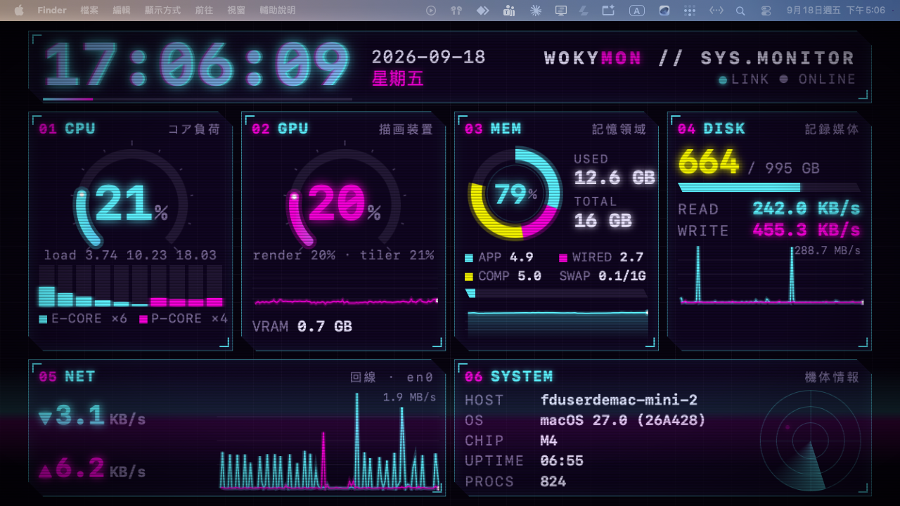
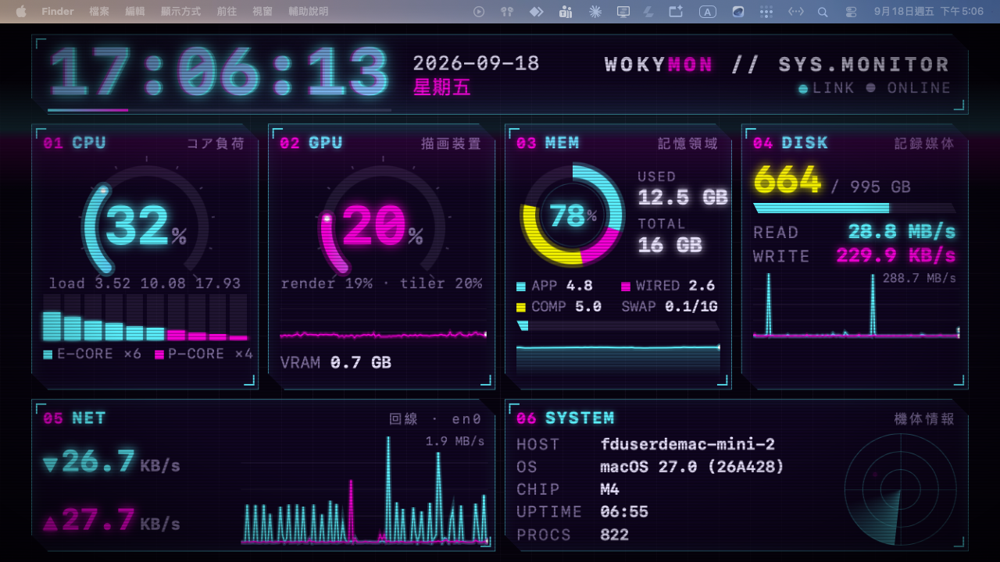

# WokyMon

Mac mini M4 資源監視器,固定顯示在 Wokyis 5 吋外接螢幕(1280x720)。細節見 `DESIGN.md`。

## 畫面

實機截圖(2026-09-18,Mac mini M4,釘在 Wokyis 螢幕,預設非 overlay 模式,保留選單列):





由左至右、由上至下:時鐘與日期、CPU(總量 + E/P 每核心)、GPU(render/tiler、VRAM)、記憶體(app/compressed/wired/swap)、磁碟(用量與讀寫速度)、網路上下行、系統資訊。

## 建置

```
swift build -c release
```

## 執行參數

```
.build/release/WokyMon [--windowed] [--overlay] [--screen <name>] [--keep-awake] [--interval <seconds>] [--dump]
```

- `--windowed`:強制在主螢幕開一個 1280x720 的普通視窗(開發/示範用),不釘螢幕。
- `--screen <name>`:找不到 Wokyis 時,依 `NSScreen.localizedName` 指定備援螢幕。
- `--overlay`:蓋住整個 Wokyis 螢幕(含選單列),並浮在所有視窗之上,沒有東西能蓋住它。**預設不開**:預設模式視窗壓在所有一般視窗之下、避開選單列,其他視窗可以拖到它上面。
- `--keep-awake`:阻止顯示器閒置睡眠(`IOPMAssertionCreateWithName`)。預設關閉,因為 macOS 無法只讓單一螢幕不睡,開啟後所有螢幕都會保持常亮,請自行評估。
- `--interval <seconds>`:採樣間隔,預設 `1.0` 秒。
- `--dump`:不開視窗,採樣兩次(間隔 `--interval` 秒)後把一筆 Snapshot 印成 JSON 到 stdout 並結束(exit 0)。同時會把資源套件(`ui/index.html`)解析結果印到 stderr,可用來驗證 `Bundle.module` 是否正確找到資源。

沒有指定螢幕時的選擇順序:Wokyis 的 vendor/model(`4691`/`9557`)→ `localizedName == "Wokyis"` → `--screen` 參數 → 都找不到就退回 `--windowed` 的普通視窗。

## 打包成 .app

`Scripts/make-app.sh --install` 會在打包後把 app 複製到 `/Applications/WokyMon.app`(不可寫時退到 `~/Applications`)。之後可直接從 Launchpad / Finder 啟動,或 `open -a WokyMon`。

```
Scripts/make-app.sh
```

產出 `build/WokyMon.app`(含 ad-hoc 簽章)。腳本最後會執行一次 `--dump` 驗證資源套件在 `.app` 內能正確解析。

## 安裝 / 解除安裝開機啟動項

```
Scripts/install-agent.sh            # 安裝並啟動 LaunchAgent(local.wokymon)
Scripts/install-agent.sh --uninstall   # bootout 並刪除 plist
```

安裝前請先跑過 `Scripts/make-app.sh`。LaunchAgent 設定 `RunAtLoad=true`、`KeepAlive={SuccessfulExit=false}`(正常結束不重啟,只有崩潰才重啟)、`ThrottleInterval=10`。Log 在 `~/Library/Logs/WokyMon/`。

## 如何停止

該螢幕會被 App 完全蓋住,無法直接在該螢幕上操作。請到主螢幕或用 SSH/終端機執行:

```
killall WokyMon
```

若有裝 LaunchAgent 會在 10 秒後自動重啟;要徹底停用請用 `Scripts/install-agent.sh --uninstall`,或手動 `launchctl bootout gui/$UID/local.wokymon`。

在非釘選模式(`--windowed`)下,視窗有選單可以 Cmd+Q 結束;釘選在 Wokyis 螢幕時,按 Esc 也能結束程式。

## E/P 核心索引假設

`host_processor_info` 回傳的每核心陣列順序,目前**假設**索引 `0..<ecores` 是 Efficiency 核心、其餘是 Performance 核心(`ecoresFirst = true`)。這是社群工具(如 macmon、Stats)的觀察,不是 Apple 官方保證的行為。這個假設只影響 UI 幫核心上色(E 核青色、P 核洋紅色),就算判斷錯誤也不影響 CPU 使用率的數值本身。

## 畫面除錯

- 直接用瀏覽器開 `Sources/WokyMon/Resources/ui/index.html`(或加 `?demo=1`):3 秒內沒收到 Swift 資料就進 demo 模式,用假資料跑動畫。
- 環境變數 `WOKYMON_UI_QUERY` 會把查詢字串附到頁面 URL,用來做效能對照:

```
WOKYMON_UI_QUERY="noanim=1" .build/release/WokyMon     # 關閉所有 CSS 動畫
WOKYMON_UI_QUERY="notween=1" .build/release/WokyMon    # 數字不補間
WOKYMON_UI_QUERY="nocanvas=1" .build/release/WokyMon   # 不畫 Canvas
```

## 實測開銷

主程序 + 3 個 WebKit 行程合計約 8–10% 單核心(Mac mini M4,整機約 1%),記憶體約 180 MB。細節見 `DESIGN.md` 第 8 節。
